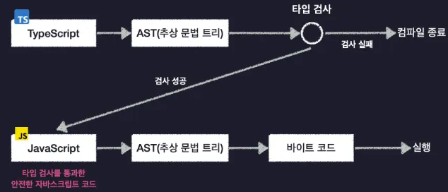

# 대다수의 프로그래밍 언어는 어떻게 동작할까?

컴퓨터는 우리가 작성한 코드를 실행하기 위해서 이 코드를 자기가 해석하기 쉬운 형태로 변환하는 함 **= 컴파일**  
그래서 우리가 프로그래밍 언어로 작성한 코드를 컴파일 하면 코드가 컴퓨터가 이해할 수 있는 기계어 같은 형태로 변환됨

  
그리고 이렇게 코드를 컴파일하는 녀석 = **컴파일러**  
자바나 자바스크립트같은 언어를 컴파일하면 바이트 코드라는 형식으로 변환이됨.  
 

  

 

**그런데 컴파일러는 어떤 과정을 거쳐 코드를 컴파일할까?**

1. 우선 컴파일러는 우리가 작성한 코드를 바로 바이트코드로 변환하는게 아니라 그 전에 AST(추상 문법 트리)라는 특별한 형태로 먼저 변환을 함

  
 
2. 그림처럼 코드의 공백이나 주석 탭 등의 코드 실행에 관계없는 그런 요소들은 전부 제거하고 트리 형태의 자료구조에 코드를 쪼개 저장 해 놓은 형태를 말함

  
 
3. 이렇게 코드를 AST로 변환하고 나면 이제 마지막으로 컴파일러가 AST를 바이트코드로 변환하고 컴파일이 종료됨

  
 
# 타입스크립트의 동작 과정

1. 타입스크립트도 다른 언어들과 마찬가지로 코드를 AST로 변환함. (여기까지는 같음)

  

2. **AST를 바이트코드로 변환하는게 아니라 이 AST를 보고 코드 상에 타입 오류가 없는지 검사하는 타입 검사가 수행됨**
- 만약 이때 우리 코드를 잘못 작성해서 코드에 타입 오류가 있었다면 타입 검사 실패 + 컴파일 중단

3. **타입 오류가 없는 정상적인 코드라면 타입 검사를 성공적으로 통과하고 그 다음에는 AST를 바이트코드가 아니라 자바스크립트로 변환**
4. 그 후 종료

  

정리

- 대부분의 언어를 컴파일 하면 바이트코드가 만들어짐
- **하지만 TS는 자바스크립트 코드가 만들어짐**

이렇게 TS 컴파일 결과로 만들어진 JS 코드를 Node.js나 웹브라우저로 실행하면 앞서 살펴본 대다수의 언어들과 동일한 과정을 거쳐 컴파일 되어 실행됨

**⭐ 중요한 점**

**TS 코드의 컴파일 과정에 타입 검사가 포함되어 있기 때문에 TS 코드를 컴파일 해서 생성한 JS 코드는 타입 검사를 통과한 JS 코드라는 점. = 타입 오류가 발생할 가능성이 낮은 안전한 JS 코드**

  

또 다른 사실

- TS에 작성한 타입 관련 코드들은 결국 JS로 변환될때 사라지게 되어 프로그램 실행에 영향을 미치지 않음  

 

따라서 정리를 하면

- TS는 컴파일 결과 타입 검사를 거쳐 JS 코드로 변환되는데 이떄 만약 코드에 오류가 있다면 컴파일 도중 실패하기때문에 JS를 보다 안전하게 사용하는 미리 한번 코드를 검사하는 용도로 사용됨

