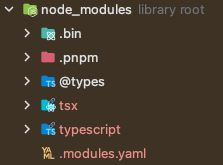

# Node.js 패키지 초기화


```tsx
pnpm init
```


# @types/node 설치하기


새로운 타입스크립트 프로젝트를 시작할 때 패키지 초기화 이후 가장 먼저 해 주어야 하는 일이 있음

**→ Node.js 내장 기능들의 타입 정보를 담고 있는 `@types/node` 라는 패키지를 설치해야 함**

```tsx
bun add @types/node
```
<br>
`@types/node` 라이브러리는 Node.js가 제공하는 기본 기능에 대한 타입 정보를 가지고 있음.

if. 이 라이브러리를 설치하지 않으면 Node.js가 제공하는 console 등의 기본 기능들의 타입이 선언되지 않아 타입스크립트 컴파일 과정에서 타입 검사가 실패하여 오류 발생…

<br>
성공적으로 설치가되면 `node_modules` 폴더에 `@types` 폴더가 생김

  

# 타입스크립트 컴파일러 설치하기


다음은 타입스크립트 컴파일러를 설치해야함. 타입스크립트 컴파일러(tsc)는 npm의 TS패키지에 동봉되어 있음.

터미널에 다음 명령어를 입력해 TS 패키지를 설치함

```tsx
pnpm i -g tyepscript
```  

<br>

**타입스크립트를 컴파일 하기 위해서는 타입스크립트 패키지를 설치해 주어야 함**

- -g 옵션으로 전역으로 설치
- 전역으로 설치하면 마치 pc에 설치된 프로그램처럼 터미널에 패키지 이름을 호출해 사용할 수 있음

<br>

설치가 완료되면 이를 확인하기 위해서 타입스크립트의 버전을 출력하는 명령어를 입력해서 확인함

```tsx
tsc -v
Version 4.9.5
```

# 타입스크립트 실행하기


## 타입스크립트 파일 만들기


src 폴더를 생성한 다음 `index.ts` 파일을 생성하고 다음과 같이 작성함.

- TS 파일 확장자는 `ts`임

```tsx
console.log("Hello TypeScript");
const a: number = 1;
```

<br>

## tsc로 컴파일하고 실행하기


코드를 작성하면 TS 컴파일러를 이용해 이 타입스크립트 코드를 컴파일 함. 터미널에 다음 명령을 입력

```tsx
> tsc src/index.ts
```

```tsx
> bun run src/index.ts
```

<br>

`tsc` 파일명은 특정 파일을 컴파일 하도록 타입스크립트 컴파일러에게 지시하는 명령어임. 위 명령어를 입력하면 `src/index.ts` 파일을 타입스크립트 컴파일러가 컴파일 함

컴파일이 완료되면 자바스크립트 파일 `src/index.js` 가 생성이 됨.

```tsx
console.log("Hello TypeScript");
var a = 1;
```
<br>

이렇게 컴파일 된 JS 코드는 node를 이용해 실행할 수 있음

```tsx
> node src/index.js
Hello Typescript
```

<br>

# TSX(TypeScript Execute)로 실행하기


<aside>
💡

**`ts-node`는 `tsx`로 대체 됨**

</aside>
<br>

전에 TS 코드를 실행하기 위해 `tsc`를 이용해 TS 코드를 JS코드로 변환한 다음 Node.js로 실행함.

하지만 지금은 명령어 한 번으로 타입스크립트 코드를 바로 실행시켜주는 도구 `tsx`에 대해 알아봄

> **tsx는 단 한 번의 명령어로 TS코드를 실행시켜주는 도구**
>

```tsx
pnpm i -g tsx
```

<br>

설치가 완료되면 다음 명령어를 터미널에 입력해서 제대로 설치되었는지 확인

```tsx
> tsx -v
tsx v4.6.2
node v20.9.0
```

<br>

이제 `tsx`를 이용해서 타입스크립트 파일 실행

```tsx
> tsx src/index.ts
Hello TypeScript
```

**→ JS 파일을 생성하지 않고 한 번에 타입스크립트 파일을 실행함**
