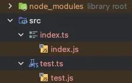
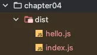
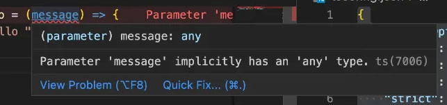

# 4. 타입스크립트 컴파일러 옵션 설정하기

# 4. 타입스크립트 컴파일러 옵션 설정하기

# 컴파일러 옵션이란


타입스크립트의 컴파일은 우리가 작성한 코드에 타입 오류가 없는지 검사하고 오류가 없다면 JS 코드로 변환함

**이러한 컴파일 과정에서 아주 세부적인 사항들 예를 들어 얼마나 엄격하게 타입 오류를 검사할 건지 또는 컴파일 결과 생성되는 JS 코드의 보전은 어떻게 할 것인지 등의 컴파일의 아주 세부적인 사항들을 컴파일러 옵션이라고 함**

컴파일러의 옵션은 프로그래머 우리 자신의 입맛에 맞게 자유롭게 변경하는 행위를 말함.

TS에서는 이런 컴파일러 옵션을 아주 자유롭고 쉽게 설정할 수 있음.
→ 프로젝트 성격에 따라 최적화된 맞춤 설정을 만들어서 사용할 수 있다는 뜻  
<br>

# 컴파일러 옵션 자동 생성하기


TS의 컴파일러 옵션은 패키지 루트 폴더 아래 `tsconfig.json`이라는 파일에 설정할 수 있으며 Node.js 패키지 단위로 설정됨

컴파일러 옵션을 설정하는 가장 쉽고 빠른 방법은 자동 생성 도구를 이용하는 방법임

- tsc를 이용하면 기본 옵션이 설정된 컴파일러 옵션 파일을 자동 생성할 수 있음  

<br>

터미널에 다음 명령어를 입력하면 자동으로 기본 설정이 완료된 `tsconfig.json` 파일이 생성됨

```tsx
tsc --init
```

```json
{
  "compilerOptions": {
    /* Visit https://aka.ms/tsconfig to read more about this file */

    /* Projects */
    // "incremental": true,                              /* Save .tsbuildinfo files to allow for incremental compilation of projects. */
    // "composite": true,                                /* Enable constraints that allow a TypeScript project to be used with project references. */
    // "tsBuildInfoFile": "./.tsbuildinfo",              /* Specify the path to .tsbuildinfo incremental compilation file. */
    // "disableSourceOfProjectReferenceRedirect": true,  /* Disable preferring source files instead of declaration files when referencing composite projects. */
    // "disableSolutionSearching": true,                 /* Opt a project out of multi-project reference checking when editing. */
    // "disableReferencedProjectLoad": true,             /* Reduce the number of projects loaded automatically by TypeScript. */

    /* Language and Environment */
    "target": "es2016",                                  /* Set the JavaScript language version for emitted JavaScript and include compatible library declarations. */
    // "lib": [],                                        /* Specify a set of bundled library declaration files that describe the target runtime environment. */
    // "jsx": "preserve",                                /* Specify what JSX code is generated. */
    // "experimentalDecorators": true,                   /* Enable experimental support for legacy experimental decorators. */
    // "emitDecoratorMetadata": true,                    /* Emit design-type metadata for decorated declarations in source files. */
    // "jsxFactory": "",                                 /* Specify the JSX factory function used when targeting React JSX emit, e.g. 'React.createElement' or 'h'. */
    // "jsxFragmentFactory": "",                         /* Specify the JSX Fragment reference used for fragments when targeting React JSX emit e.g. 'React.Fragment' or 'Fragment'. */
    // "jsxImportSource": "",                            /* Specify module specifier used to import the JSX factory functions when using 'jsx: react-jsx*'. */
    // "reactNamespace": "",                             /* Specify the object invoked for 'createElement'. This only applies when targeting 'react' JSX emit. */
    // "noLib": true,                                    /* Disable including any library files, including the default lib.d.ts. */
    // "useDefineForClassFields": true,                  /* Emit ECMAScript-standard-compliant class fields. */
    // "moduleDetection": "auto",                        /* Control what method is used to detect module-format JS files. */

    /* Modules */
    "module": "commonjs",                                /* Specify what module code is generated. */
    // "rootDir": "./",                                  /* Specify the root folder within your source files. */
    // "moduleResolution": "node10",                     /* Specify how TypeScript looks up a file from a given module specifier. */
    // "baseUrl": "./",                                  /* Specify the base directory to resolve non-relative module names. */
    // "paths": {},                                      /* Specify a set of entries that re-map imports to additional lookup locations. */
    // "rootDirs": [],                                   /* Allow multiple folders to be treated as one when resolving modules. */
    // "typeRoots": [],                                  /* Specify multiple folders that act like './node_modules/@types'. */
    // "types": [],                                      /* Specify type package names to be included without being referenced in a source file. */
    // "allowUmdGlobalAccess": true,                     /* Allow accessing UMD globals from modules. */
    // "moduleSuffixes": [],                             /* List of file name suffixes to search when resolving a module. */
    // "allowImportingTsExtensions": true,               /* Allow imports to include TypeScript file extensions. Requires '--moduleResolution bundler' and either '--noEmit' or '--emitDeclarationOnly' to be set. */
    // "rewriteRelativeImportExtensions": true,          /* Rewrite '.ts', '.tsx', '.mts', and '.cts' file extensions in relative import paths to their JavaScript equivalent in output files. */
    // "resolvePackageJsonExports": true,                /* Use the package.json 'exports' field when resolving package imports. */
    // "resolvePackageJsonImports": true,                /* Use the package.json 'imports' field when resolving imports. */
    // "customConditions": [],                           /* Conditions to set in addition to the resolver-specific defaults when resolving imports. */
    // "noUncheckedSideEffectImports": true,             /* Check side effect imports. */
    // "resolveJsonModule": true,                        /* Enable importing .json files. */
    // "allowArbitraryExtensions": true,                 /* Enable importing files with any extension, provided a declaration file is present. */
    // "noResolve": true,                                /* Disallow 'import's, 'require's or '<reference>'s from expanding the number of files TypeScript should add to a project. */

    /* JavaScript Support */
    // "allowJs": true,                                  /* Allow JavaScript files to be a part of your program. Use the 'checkJS' option to get errors from these files. */
    // "checkJs": true,                                  /* Enable error reporting in type-checked JavaScript files. */
    // "maxNodeModuleJsDepth": 1,                        /* Specify the maximum folder depth used for checking JavaScript files from 'node_modules'. Only applicable with 'allowJs'. */

    /* Emit */
    // "declaration": true,                              /* Generate .d.ts files from TypeScript and JavaScript files in your project. */
    // "declarationMap": true,                           /* Create sourcemaps for d.ts files. */
    // "emitDeclarationOnly": true,                      /* Only output d.ts files and not JavaScript files. */
    // "sourceMap": true,                                /* Create source map files for emitted JavaScript files. */
    // "inlineSourceMap": true,                          /* Include sourcemap files inside the emitted JavaScript. */
    // "noEmit": true,                                   /* Disable emitting files from a compilation. */
    // "outFile": "./",                                  /* Specify a file that bundles all outputs into one JavaScript file. If 'declaration' is true, also designates a file that bundles all .d.ts output. */
    // "outDir": "./",                                   /* Specify an output folder for all emitted files. */
    // "removeComments": true,                           /* Disable emitting comments. */
    // "importHelpers": true,                            /* Allow importing helper functions from tslib once per project, instead of including them per-file. */
    // "downlevelIteration": true,                       /* Emit more compliant, but verbose and less performant JavaScript for iteration. */
    // "sourceRoot": "",                                 /* Specify the root path for debuggers to find the reference source code. */
    // "mapRoot": "",                                    /* Specify the location where debugger should locate map files instead of generated locations. */
    // "inlineSources": true,                            /* Include source code in the sourcemaps inside the emitted JavaScript. */
    // "emitBOM": true,                                  /* Emit a UTF-8 Byte Order Mark (BOM) in the beginning of output files. */
    // "newLine": "crlf",                                /* Set the newline character for emitting files. */
    // "stripInternal": true,                            /* Disable emitting declarations that have '@internal' in their JSDoc comments. */
    // "noEmitHelpers": true,                            /* Disable generating custom helper functions like '__extends' in compiled output. */
    // "noEmitOnError": true,                            /* Disable emitting files if any type checking errors are reported. */
    // "preserveConstEnums": true,                       /* Disable erasing 'const enum' declarations in generated code. */
    // "declarationDir": "./",                           /* Specify the output directory for generated declaration files. */

    /* Interop Constraints */
    // "isolatedModules": true,                          /* Ensure that each file can be safely transpiled without relying on other imports. */
    // "verbatimModuleSyntax": true,                     /* Do not transform or elide any imports or exports not marked as type-only, ensuring they are written in the output file's format based on the 'module' setting. */
    // "isolatedDeclarations": true,                     /* Require sufficient annotation on exports so other tools can trivially generate declaration files. */
    // "allowSyntheticDefaultImports": true,             /* Allow 'import x from y' when a module doesn't have a default export. */
    "esModuleInterop": true,                             /* Emit additional JavaScript to ease support for importing CommonJS modules. This enables 'allowSyntheticDefaultImports' for type compatibility. */
    // "preserveSymlinks": true,                         /* Disable resolving symlinks to their realpath. This correlates to the same flag in node. */
    "forceConsistentCasingInFileNames": true,            /* Ensure that casing is correct in imports. */

    /* Type Checking */
    "strict": true,                                      /* Enable all strict type-checking options. */
    // "noImplicitAny": true,                            /* Enable error reporting for expressions and declarations with an implied 'any' type. */
    // "strictNullChecks": true,                         /* When type checking, take into account 'null' and 'undefined'. */
    // "strictFunctionTypes": true,                      /* When assigning functions, check to ensure parameters and the return values are subtype-compatible. */
    // "strictBindCallApply": true,                      /* Check that the arguments for 'bind', 'call', and 'apply' methods match the original function. */
    // "strictPropertyInitialization": true,             /* Check for class properties that are declared but not set in the constructor. */
    // "strictBuiltinIteratorReturn": true,              /* Built-in iterators are instantiated with a 'TReturn' type of 'undefined' instead of 'any'. */
    // "noImplicitThis": true,                           /* Enable error reporting when 'this' is given the type 'any'. */
    // "useUnknownInCatchVariables": true,               /* Default catch clause variables as 'unknown' instead of 'any'. */
    // "alwaysStrict": true,                             /* Ensure 'use strict' is always emitted. */
    // "noUnusedLocals": true,                           /* Enable error reporting when local variables aren't read. */
    // "noUnusedParameters": true,                       /* Raise an error when a function parameter isn't read. */
    // "exactOptionalPropertyTypes": true,               /* Interpret optional property types as written, rather than adding 'undefined'. */
    // "noImplicitReturns": true,                        /* Enable error reporting for codepaths that do not explicitly return in a function. */
    // "noFallthroughCasesInSwitch": true,               /* Enable error reporting for fallthrough cases in switch statements. */
    // "noUncheckedIndexedAccess": true,                 /* Add 'undefined' to a type when accessed using an index. */
    // "noImplicitOverride": true,                       /* Ensure overriding members in derived classes are marked with an override modifier. */
    // "noPropertyAccessFromIndexSignature": true,       /* Enforces using indexed accessors for keys declared using an indexed type. */
    // "allowUnusedLabels": true,                        /* Disable error reporting for unused labels. */
    // "allowUnreachableCode": true,                     /* Disable error reporting for unreachable code. */

    /* Completeness */
    // "skipDefaultLibCheck": true,                      /* Skip type checking .d.ts files that are included with TypeScript. */
    "skipLibCheck": true                                 /* Skip type checking all .d.ts files. */
  }
}

```

이 파일을 열어보면 많은 옵션이 기본적으로 설정되어 있는 걸 볼 수 있음. 그러나 거의 모든 옵션이 주석 처리되어 있기에 실제 적용되고 있는 옵션은 몇 개 되지 않음  
<br>

# 컴파일러 옵션 직접 설정하기


TS의 컴파일러 옵션 설정방법을 알아보려고 하기 때문에 자동 생성된 옵션은 사용하지 않음. 따라서 `tsconfig.json`의 모든 내용을 다 지우고 하나씩 필요한 옵션을 설정해봄  

<br>

초기 파일 세팅

```json
{
}
```

<br>

### include 옵션

> **tsc에게 컴파일 할 타입스크립트 파일의 범위와 위치를 알려주는 옵션. 이 옵션을 사용하면 다음과 같이 파일이 아주 많을 때 일일히 tsc 명령어와 함께 파일 명을 입력하지 않아도 됨**
>

```json
{
  "include": [
    "src"
  ]
}
```

→ 이렇게 설정하면 tsc 명령어만 입력해도 src 폴더 아래의 모든 TS 파일이 동시에 컴파일 됨  

<br>

실습을 해보면 `src` 밑에 `test.ts`를 만들고 다음과 같이 작성을 함

```tsx
console.log("Hello Test!");
```

<br>

그 다음 터미널에 `tsc`를 입력하면 이전에 만들어 둔 `index.ts`와 방금 만든 `test.ts` 파일이 동시에 컴파일이 됨

  

<br>

### target 옵션

> **컴파일 결과 생성되는 자바스크립트 코드의 버전을 설정함**
>

```tsx
{
  "compilerOptions": {
    "target": "ES5"
  },
  "include": [
    "src"
  ]
}
```

tsc를 이용해 컴파일 하면 TS 코드가 ES5 버전의 JS 코드로 변환됨  
<br>


`index.ts`

```tsx
const func = () => console.log("Hello");
```  
<br>


`index.js`

```tsx
console.log("Hello TypeScript");
var a = 1;
```

→ 컴파일 하고 결과를 확인하면 다음과 같이 화살표 함수가 함수 표현식으로 변환됨.  
<br>


**target 옵션을 ES5로 설정했기 때문에 컴파일 과정에서 화살표 함수 같은 ES6의 문법이 ES5 문법으로 변환이된 것**


<br>

**target 옵션을 `ESNext`(최신 JS 버전)으로 설정하고 동일한 과정을 반복해보자**

```tsx
{
  "compilerOptions": {
    "target": "ESNext"
  },
  "include": [
    "src"
  ]
}
```

반환된 결과를 보면

`index.js`

```tsx
"use strict";
Object.defineProperty(exports, "__esModule", { value: true });
const func = () => console.log("Hello");
```

<br>


### module 옵션

> **변환되는 자바스크립트 코드의 모듈 시스템을 설정함**
>

`tsconfig.json`에 module 옵션을 추가하고 값으로 CommonJS를 설정함

```tsx
{
  "compilerOptions": {
    "target": "ESNext",
		"module": "CommonJS"
  },
  "include": ["src"]
}
```

<br>


`hello.ts`를 생성하고 다음과 같이 작성을 함

```tsx
export const hello = () => {
  console.log("hello");
};
```
<br>


그 다음 `index.ts`를 다음과 같이 수정함

```tsx
import { hello } from "./hello";
console.log(hello);
```

**TS에서는 JS의 ES 모듈 시스템과 유사하게 내보낼 때는 `export`를 사용하고 불러올 때는 `import`를 사용함**

<br>


`tsc`로 컴파일 하면

```tsx
"use strict";
Object.defineProperty(exports, "__esModule", { value: true });
const hello_1 = require("./hello");
console.log(hello_1.hello);
```

→ `require`나 `exports` 등의 CommonJS 문법으로 코드가 변환된 것을 볼 수 있음.

→ module를 CommonJS로 설정해 두었기 때문  

<br>


module 옵션을 ESNext로 설정

```tsx
{
  "compilerOptions": {
    "target": "ESNext",
    **"module": "ESNext"**
  },
  "include": [
    "src"
  ]
}
```

<br>


다시 컴파일 하고 결과를 확인하면

```tsx
import { hello } from "./hello";
console.log(hello);
```

→ ES 모듈 시스템을 사용하는 것을 확인할 수 있음

<br>


### outDir

> **컴파일 결과 생성할 JS 코드 위치를 결정하는 옵션**
>

```tsx
{
  "compilerOptions": {
    "target": "ESNext",
    "module": "ESNext",
    "outDir": "dist"
  },
  "include": [
    "src"
  ]
}
```

→ 컴파일 결과가 `dist` 폴더에 생성됨



<br>


### strict

> **TS 컴파일러의 타입 검사 엄격함 수준을 정하는 옵션**
>

<br>

`hello.ts` 수정

```tsx
export const hello = (message) => {
    console.log("hello " + message);
};
```

→ 이 함수는 매개변수 message를 제공받도록 코드를 수정함

→ 현재는 아무런 오류 발생하지 않음

<br>


다음과 같이 `strict` 옵션을 true로 설정

```tsx
{
  "compilerOptions": {
    "target": "ESNext",
    "module": "ESNext",
    "outDir": "dist",
    "strict": true
  },
  "include": [
    "src"
  ]
}
```

<br>


그리고 `hello.ts`를 보면 오류가 있다고 알려줌

  
타입을 프로그래머가 직접 지정하지 않을 경우 엄격한 타입 검사 모드에서는 오류가 발생하게 됨.

<br>


### ModuleDetection 옵션

> **이 옵션을 force로 설정할 경우 자동으로 모든 TS 파일이 로컬 모듈로 취급됨**
>

TS의 모든 파일은 기본적으로 파일로 취급됨. 따라서 다음과 같이 a.ts와 b.ts 두 타입스크립트 파일을 만들고 동일한 이름의 변수를 선언하면 오류가 발생하게 됨

```tsx
// a.ts

const a = 1; // ❌

// b.ts

const a = 1; // ❌
```

→ 이럴 때 최소 하나 이상 사용해 해당 파일을 전역 모듈이 아닌 로컬 모듈로 취급되도록 만들어야 하는데 이를 자동화하는 옵션이 이 옵션임

<br>


```tsx
{
  "compilerOptions": {
    "target": "ESNext",
    "module": "ESNext",
    "outDir": "dist",
    "moduleDetection": "force",
    "strict": true
  },
  "include": [
    "src"
  ]
}
```
