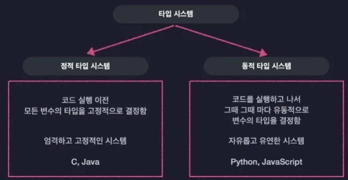

> **모든 프로그래밍 언어에는 타입 시스템이 있다**
>

### 타입 시스템이란?

**: 언어에서 사용할 수 있는 아주 여러가지 값들을 어떤 기준으로 묶어서 타입으로 정할지 결정하고 또 코드의 타입을 언제 검사할지 그리고 어떻게 검사할지 등의 우리가 프로그래밍 언어를 사용할 때 타입과 관련해서 지켜야 하는 규칙을 모아둔 체계**

타입 시스템은 크게 두 가지로 나눌 수 있음

1. **코드 실행전에 모든 변수의 타입을 고정적으로 결정 = 정적 타입 시스템(엄격함 + 고정적)**
2. **코드를 실행하기 전에는 타입을 결정하지 않고 코드를 실행하고 나서 그때 그때마다 유동적으로 변수의 타입을 결정 = 동적 타입 시스템(자유로움 + 유연함)**



### 동적 타입 시스템

JS가 사용하는 동적 타입 시스템은 기본적으로 변수의 타입들을 코드가 실행되는 도중에 결정하기 때문에 우리가 미리 변수에 타입을 설정하지 않아도 된다는 유연함을 장점으로 가짐

```tsx
let a = "hello";
```

→ 변수를 타입들을 코드가 실행되는 도중에 결정
  
밑 코드에서 a는 첫 번째 라인에서는 문자열 값을 담기 때문에 문자열 타입인 `string`이고, 두 번째 라인에서는 숫자 값을 담기 때문에 숫자 타입인 `number` 타입임

```tsx
let a = "hello"; // 문자열
a = 20001008; // 숫자
```

장점: 변수 하나로 여기저기 다 활용할 수 있음  
하지만 단점이 있음

```tsx
let a = "hello"; // 문자열
a = 20001008; // 숫자

a.toUpperCase();
```

**→ `toUpperCase`는 문자열에만 사용할 수 있는 메서드인데 지금 변수 a는 숫자가 들어 있기 떄문에 오류가 발생함**  
<br>
<br>
**여기서 중요한 점은 코드가 실행은 된다는 점!!**

애초에 이렇게 오류가 발생할 코드 였다면 실행 전에 검사를 거쳐서 실행하지 못하도록 막는게 좋음<br>
<br>

Why?

: 지금은 바로 오류를 확인할 수 있지만 코드가 길어지고, 복잡해지면 완전 나중에 발생할 수 있을 수 있음….

이렇게 되면 아주 치명적인 문제가 될 수 있음<br>
<br>
### 정적 타입 시스템

**정적 타입 시스템은 코드를 실행하기 전에 모든 변수의 타입을 결정함**

그래서 앞에서 본 문제는 정적 타입 시스템에서 잘 발생하지 않음.
<br>
<br>

### 정적 타입 시스템의 단점

- 타입을 다 정의해야 하기 때문에 일단 매우 귀찮고 우리가 작성해야 하는 코드의 양이 늘어남

<br>

### 타입스크립트와 점진적 타이핑

TS는 좀 독특한 타입 시스템을 사용하는데, 마치 자바스크립트의 동적 타입 시스템과 자바의 정적 타입 시스템을 혼합한 것 같은 독특한 타입시스템을 사용함.

**TS에는 마치 정적 타입 시스템 처럼 변수의 타입을 코드 실행 전에 결정하고 타입 오류가 없는지 프로그램 실행 전에 코드를 검사함**

```tsx
let a: number = 1;
a.toUpperCase(); // error
```

**하지만 TS는 이렇게 정적 타입 시스템처럼 안전하면서도 마치 동적 타입 시스템처럼 모든 변수에 일일이 우리가 직접 타입을 명시하지 않아도 됨**

```tsx
let a = 1;
a.toUpperCase(); // error
```

→ 변수 a를 숫자 타입으로 자동으로 인지해서 코드에 오류가 있음을 빨간줄로 알려줌
