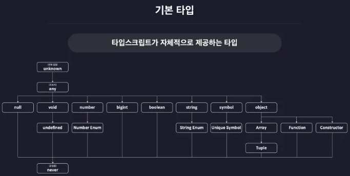

# 0. 기본타입이란

# 기본 타입(Basic Types)이란?


> **타입스크립트가 자체적으로 제공하는 타입 = 내장 타입**
>  
<br>

  
- 다음 그림과 같이 TS에는 꽤 많은 기본 타입들이 제공이 됨.
- 기본 타입들은 서로 부모 자식 관계를 이루며 계층을 형성함

# 실습 환경 설정하기


```tsx
pnpm init
```

패키지 초기화가 끝났으면 `@types/node` 패키지를 설치함.  

<br>

그 다음은 컴파일러 옵션 파일을 생성하고 옵션을 설정할 차례.

- 프로젝트 루프 폴더, 이 시점에는 section2 폴더 아래 `tsconfig.json` 파일을 만들고 다음과 같이 옵션을 설정함

```tsx
{
  "compilerOptions": {
    "target": "ESNext",
    "module": "ESNext",
    "outDir": "dist",
    "strict": true,
    "moduleDetection": "force"
  },
  "include": [
    "src"
  ]
}
```

→ `target`: 컴파일 결과 생성되는 JS 코드의 버전 결정, ESNext는 최신 자바스크립트를 의미함

→ `module`: 컴파일 결과 생성되는 자바스크립트 코드의 모듈 시스템 결정

→ `outDir`: 컴파일 결과 생성되는 자바스크립트 파일의 위치 결정

→ `strict`: 엄격한 타입 검사 여부 설정

→ `moduleDetection`: 모든 TS 파일에 export 키워드를 자동으로 추가하여 격리된 모듈로 취급하도록 만드는 옵션

→ `include`: tsc로 컴파일 할 TS 파일의 범위 설정  
<br>

잘동작하는지 확인하는 작업.

`src` 폴더를 만든 후 그 안에 `index.ts` 파일을 만들어 다음과 같이 작성함

```tsx
console.log("Hello New Project");
```


<br>
그 다음 TS 컴파일러를 이용해 src 폴더 아래의 모든 타입스크립트 파일을 컴파일 함

```tsx
tsc
```

컴파일 결과 JS 파일이 `section2/dist`에 잘 생성되었는지 확인함

```tsx
console.log("Hello New Project");
export {};
```


<br>
다음으로는 node를 이용해 이 파일을 실행하기 위해 `package.json`의 type을 module로 설정함

```tsx
{
	...
	"type": "module",
	...
}
```

→ 이는 `tsconfig.json`의 `module` 옵션을 ESNext로 설정했기 때문에 자동으로 TS 코드가 ES 모듈 시스템을 사용하는 JS 코드로 컴파일 되기 때문.

→ 따라서 다음과 같은 작업이 필요함

```tsx
> node dist/index.js
Hello New Project
```


<br>
잘 실행되면 `ts-node`를 이용해 타입스크립트 파일을 즉시 실행할 수 있도록 `tsconfig.json`에 `ts-node` 옵션을 추가함

```tsx
{
  "compilerOptions": {
    "target": "ESNext",
    "module": "ESNext",
    "outDir": "dist",
    "strict": true,
    "moduleDetection": "force"
  },
  **"ts-node": {
    "esm": true
  },**
  "include": [
    "src"
  ]
}
```


<br>
이제 `ts-node`를 이용해 `index.ts`를 즉시 실행

```tsx
> ts-node src/index.ts
Hello New Project
```
