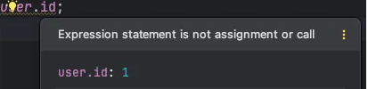
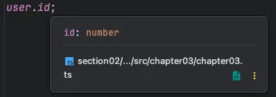

# 3. 객체

## 객체 타입을 정의하는 방법

TS에서는 2가지 방식으로 객체의 타입을 정의할 수 있음
  
<br>  

### object로 정의하기

객체 타입을 정의하기 앞서 간단한 객체를 만듬

```tsx
let user = {
  id: 1,
  name: "문동민",
};
```

<br>

다음으로 `user` 타입을 객체를 의미하는 `object`로 정의함

```tsx
let user: object = {
    id: 1,
    name: "문동민",
};
```

→ 잘 정의됨

<br>

🚨 하지만 이렇게 타입을 정의하면 문제가 발생함.

```tsx
let user: object = {
    id: 1,
    name: "문동민",
};

user.id;
```

**→ 위처럼 점 표기법으로 객체의 특정 프로퍼티에 접근하려고 하면 오류가 발생함**

  

이 에러는 object 타입에 id 프로퍼티가 없다고 나옴

<br>


우리는 object로 타입을 잘 정의해주었는데 왜 이런 오류가 나올까?

- **TS의 object 타입은 단순 값이 객체임을 표현하는 것 외에는 아무런 정보도 제공하지 않는 타입기 때문**
- 따라서 이 타입은 객체의 프로퍼티에 대한 정보를 전혀 가지고 있지 않음…


<br>


⭐ 문제해결

**이럴 때는 object가 아닌 객체 리터럴 타입을 사용해야 함**

<br>


### 객체 리터럴 타입

**객체 리터럴 타입은 다음과 같이 중괄호를 열고 객체가 갖는 프로퍼티를 직접 나열해 만드는 타입**

```tsx
let user: {
    id: number;
    name: string;
} = {
    id: 1,
    name: "문동민",
};

user.id;
```

→ 변수 user 타입을 number 타입의 id 그리고 string 타입의 name 프로퍼티를 갖는 객체 타입으로 정의함

<br>


변수의 타입을 객체 리터럴 타입으로 정의하면 이제 타입내에 정의되어 있는 프로퍼티에 이상 없이 접근할 수 있게 됨. 지금은 점 표기법으로 접근했지만 괄호 표기법을 사용할 때에도 동일하게 잘 접근됨


또 프로퍼티에 마우스 커서를 올려보면 프로퍼티 값의 타입도 잘 나타남

  

따라서 객체의 타입을 정의할 때는 object 보다는 객체 리터럴 타입을 사용하게 좋음.

<br>


알 수 있는 사실

- TS는 기존의 정적 타입 시스템을 따르는 언어인 C나 Java와는 달리 객체의 타입을 정의할 때 프로퍼티를 기준으로 객체의 구조를 정의하는 듯이 타입을 정의함
- TS의 이러한 특징을 **구조적 타입 시스템**이라 부름
    - 객체의 구조를 결정하는 것은 프로퍼티
    - 따라서 TS는 이 객체에 어떤 프로퍼티들이 있어야 하는지 정의하는 방식으로 객체의 타입을 정의함

## 특수한 프로퍼티 정의하기


객체의 타입을 정의할 때 특정 프로퍼티를 선택적이거나 읽기 전용으로 만드는 TS의 독특한 문법이 있음

```tsx
let user: {
    id: number;
    name: string;
} = {
    id: 1,
    name: "문동민",
};
```

<br>


### 선택적 프로퍼티(Optional Property)

JS에서 객체를 다루다보면 자주 특정 프로퍼티는 있어도 되고 없어도 되는 그런 상황이 존재함

ex. 이름은 있어야 하지만 id가 없는 유저가 존재할 수 있음

```tsx
let user: {
    id: number;
    name: string;
} = {
    id: 1,
    name: "문동민",
};

user = {
    name: "홍길동", // 오류 발생!
};
```

→ TS에서는 오류가 발생…

→ name만 존재하는 객체를 할당했기 때문

<br>


이렇게 특정 프로퍼티를 상황에 따라 생략하도록 만들고 싶다면 해당 프로퍼티를 선택적 프로퍼티로 만들어줘야함.

이를 위해 프로퍼티의 이름 뒤에 **? 를 붙여주면 됨**

```tsx
let user: {
    **id?: number;**
    name: string;
} = {
    id: 1,
    name: "문동민",
};

user = {
    name: "홍길동", // 오류 발생!
};
```

**→ id 프로퍼티 뒤에 붙은 물음표의 의미는 이 프로퍼티는 이제 생략 가능한 선택적 프로퍼티라는 의미**

<br>


🚨 주의할 점

- **선택적 프로퍼티가 만약 존재한다면 그때의 value 타입은 반드시 number 타입이어야 함**

따라서 다음과 같이 id 프로퍼티를 추가하고 value를 string 타입의 값으로 설정하면 오류가 발생함

```tsx
let user: {
    id?: number;
    name: string;
} = {
    id: 1,
    name: "문동민",
};

user = {
    id: "id", // 오류 발생!
    name: "홍길동",
};
```

<br>


### 읽기 전용 프로퍼티(Readonly Property)

**특정 프로퍼티를 읽기 전용으로 만들고 싶다면 다음과 같이 프로퍼티의 이름 앞에 `readonly` 키워드를 붙이면 됨**

```tsx
let user: {
    id?: number;
    **readonly name: string;**
} = {
    id: 1,
    name: "문동민",
};

user.name= 'asfd'; // 오류 발생
```

name 프로퍼티는 이제 읽기 전용 프로퍼티가 되었기 때문에 마지막 라인처럼 프로퍼티의 값을 수정하려고 하면 오류가 발생함. 이를 통해 의도치 않은 프로퍼티의 수정을 방지할 수 있음
