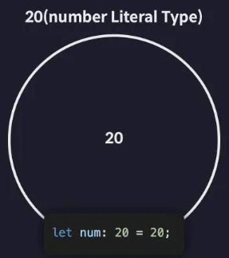
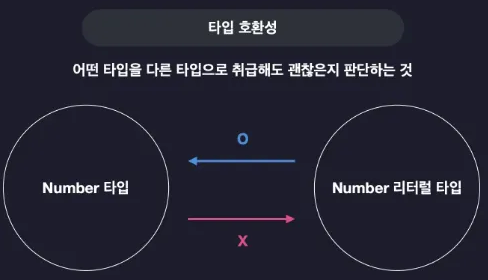

# 1. 타입은 집합이다

## 타입은 집합이다

TS의 타입은 사실 여러 개의 값을 포함하는 집합임. 집합은 동일한 속성을 갖는 여러 개의 요소들을 하나의 그룹으로 묶은 단위를 말함

 

여러 개의 숫자 값들을 묶어 놓은 집합을 TS에서는 number 타입이라 부름

  

 
그렇다면 오직 하나의 값만 포함하는 타입은 Number Literal 타입은 어떤 집합일까?

 
 

ex. 20이라는 Number Literal 타입이 존재하면 이 타입은 다음 그림과 같이 딱 하나만 포함하는 아주 작은 집합이라고 볼 수 있음

 

 

그리고 이 20이라는 타입에 속하는 요소인 숫자 20은 이 사실 집합 외에도 Number 타입이라는 거대한 집합에도 속하는 값임. 20도 결국 숫자이기 때문. 그러므로 결국 모든 Number Literal 타입은 Number 타입이라는 거대한 집합에 포함되는 부분 집합이라고 볼 수 있음

 

 

사실 TS의 모든 타입들은 집합으로써 서로 포함하고 또 포함되는 이런 관계를 가짐. 그리고 이런 관계에서 Number 타입처럼 다른 타입을 포함하는 타입을 슈퍼 타입(부모타입)이라고 부름. 반대는 서브 타입(자식 타입)

 

 

이 관계를 계층처럼 표시하면 다음과 같은 그림이 됨

  

  

→ 결국 이러한 타입 계층도가 TS가 제공하는 여러가지 기본 타입들간의 집합으로써의 부모-자식 관계였던 것.

 

## 타입 호환성

> **A와 B 두 개의 타입이 존재할 때 A 타입의 값을 B 타입으로 취급해도 괜찮은지 판단하는 것을 의미**
>

ex. 다음 그림처럼 Number 타입과 Number Literal 타입이 있을 때 서브 타입인 Number Literal 타입의 값을 슈퍼 타입인 Number 타입의 값으로 취급하는 것은 가능. 하지만 반대는 불가능…

→ Number 타입이 더 큰 타입이기 때문

  

 

다음과 같은 코드는 문제가 되지 않음

  

→ Number 타입의 변수 num1을 선언하고 값으로 10을 할당.

→ 그리고 10타입의 변수 num2를 선언하고 값으로 10을 할당.

**→ 이때 num1 에 num2의 값을 저장하는 건 가능**

 

하지만 반대는…. 성립하지 않음

  

→ 이렇게 더 큰 타입의 값을 더 작은 타입의 값으로 취급하는 것은 안됨…

 

**따라서 TS에서는 이렇게 슈퍼타입의 값을 서브타입의 값으로 취급하는 것을 허용하지 않음. 반대로는 허용함**

  

 

**업캐 케스팅**: 서브타입의 값을 슈퍼타입의 값으로 취급하는 것

**다운 캐스팅**: 이의 반대

 

정리

- **업캐스팅은 모든 상황에 가능하지만 다운 캐스팅은 대부분의 상황에 불가능하다고 할 수 있음**

