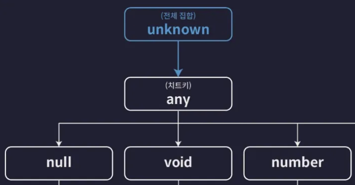
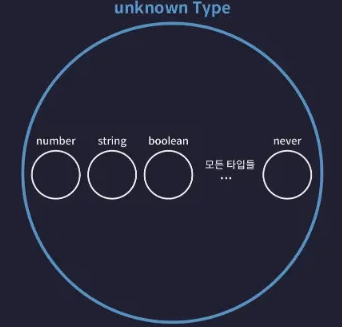
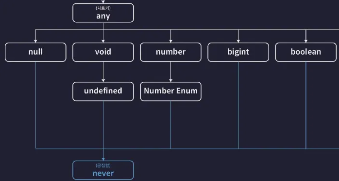
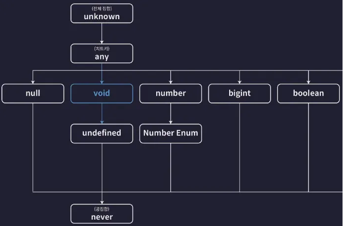
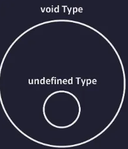

# 2. 타입 계층도와 함께 기본타입 살펴보기

## unknown 타입(전체 집합)


unknown 타입은 타입 계층도의 최상단에 위치함



<br>

따라서 unknown 타입 변수에 모든 타입의 값을 할당할 수 있음.

**→ 이는 모든 타입은 unknown 타입으로 업케스팅할 수 있음**

```tsx
let a: unknown = 1;                 // number -> unknown
let b: unknown = "hello";           // string -> unknown
let c: unknown = true;              // boolean -> unknown
let d: unknown = null;              // null -> unknown
let e: unknown = undefined;         // undefined -> unknown
let f: unknown = [];                // Array -> unknown
let g: unknown = {};                // Object -> unknown
let h: unknown = () => {};          // Function -> unknown
```

<br>

unknown 타입이 타입 계층도에서 가장 위에 있다는 뜻은 unknown 타입은 모든 타입의 슈퍼타입이라는 뜻. 그렇기에 모든 타입은 unknown 타입의 부분집합임.

결국 unknown 타입은 모든 타입을 부분집합으로 갖는 TS 전체 집합

  

<br>

**BUT unknown 타입의 값은 any를 제외한 어떠한 타입의 변수에도 할당할 수 없음**

```tsx
let unknownValue: unknown;

let a: number = unknownValue;
// 오류 : unknown 타입은 number 타입에 할당할 수 없습니다.
```

<br>

## never 타입 (공집합 타입)


never 타입은 타입 계층도에서 가장 아래에 위치함

  

never 타입은 불가능, 모순을 의미하는 타입이라고 설명했음. 타입이 집합임을 이해한 지금 never 타입을 다시 표현하자면 never는 공집합을 뜻하는 타입임.

→ 공집합 = 아무것도 포함하지 않는 집합

<br>

따라서 never 타입에 할당하는 값은 말 그대로 아무것도 없음. 따라서 다음과 같은 상황에서 never 타입이 주로 사용됨

```tsx
function errorFunc(): never {
  throw new Error();
}
```

→ 에러를 발생시키는 함수

→ 따라서 이 함수는 정상적으로 종료되지 않음. 그러므로 어떤 값도 반환하지 못해…

<br>

**또 공집합은 모든 집합의 부분 집합임. 그렇기에 never 타입은 모든 타입의 서브타입임. 따라서 never 타입은 모든 타입으로 업케스팅 할 수 있음**

```tsx
let neverVar: never;

let a: number = neverVar;            // never -> number
let b: string = neverVar;            // never -> string
let c: boolean = neverVar;           // never -> boolean
let d: null = neverVar;              // never -> null
let e: undefined = neverVar;         // never -> undefined
let f: [] = neverVar;                // never -> Array
let g: {} = neverVar;                // never -> Object
```

<br>

반면 그 어떠한 타입도 never로 다운캐스팅 할 수 없음

```tsx
let a: never = 1;                 // number -> never ❌
let b: never = "hello";           // string -> never ❌
let c: never = true;              // boolean -> never ❌
let d: never = null;              // null -> never ❌
let e: never = undefined;         // undefined -> never ❌
let f: never = [];                // Array -> never ❌
let g: never = {};                // Object -> never ❌
```

## void 타입


  

타입 계층도에서 void 타입을 찾아보면 void 타입은 undefined 타입의 슈퍼타입임을 알 수 있음.



<br>

따라서 반환값을 void로 선언한 함수에서 undefined을 반환 해도 오류가 발생하지 않음. undefined 타입은 void 타입의 서브 타입이므로 업캐스팅이 가능하기 때문

```tsx
function noReturnFuncA(): void {
  return undefined;
}

function noReturnFuncB(): void {
  return;
}

function noReturnFuncC(): void {}
```

<br>

void 타입의 서브타입은 undefined 타입과 never 타입 밖에 없음. 따라서 void 타입에는 undefined, never 이외에 다른 타입의 값을 할당할 수 없음

```tsx
let voidVar: void;

voidVar = undefined; // undefined -> void (ok)

let neverVar: never;
voidVar = neverVar; // never -> void (ok)
```

<br>

### any 타입

any 타입은 타입 계층도를 완전히 무시함…

any는 뭐든지 예외임. 모든 슈퍼타입이 될 수 있고 모든 타입의 서브 타입이 될 수 있음

```tsx
let anyValue: any;

let num: number = anyValue;   // any -> number (다운 캐스트)
let str: string = anyValue;   // any -> string (다운 캐스트)
let bool: boolean = anyValue; // any -> boolean (다운 캐스트)

anyValue = num;  // number -> any (업 캐스트)
anyValue = str;  // string -> any (업 캐스트)
anyValue = bool; // boolean -> any (업 캐스트)

```
