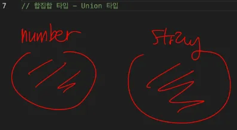
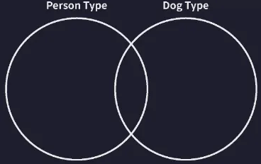
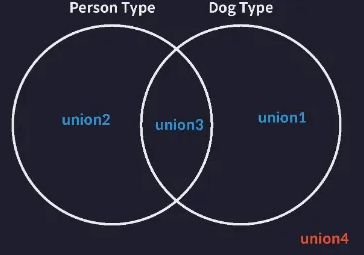
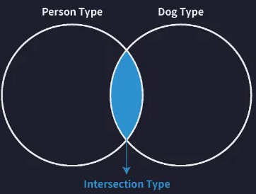

# 4. 대수 타입

## 대수 타입(Algebraic type)이란


> **여러개의 타입을 합성해서 만드는 타입**
>

대수 타입에는 합집합 타입과 교집합 타입이 존재함.

- 합집합: `Union`
- 교집합: `Intersection`

<br>

## 합집합(Union) 타입

string 과 number의 유니온 타입을 정의할 수 있음. 바 `|` 를 사용함

```tsx
// 합집합 타입 - Union 타입
let a: string | number;
```

<br>

이 유니온 타입을 집합으로 표현하면 다음과 같음.

  

<br>

따라서 이제 변수 a에 number 타입과 string 타입에 해당하는 값이라면 뭐든 저장할 수 있음.

```tsx
// 합집합 타입 - Union 타입
let a: string | number;

a = 1;
a = "hello";
```

<br>

유니온 타입에 참여하는 타입의 개수에는 제한이 없음. 만약 boolean 타입도 함께 유니온 타입으로 구성하고 싶으면 다음과 같이 그냥 추가하면 됨

```tsx
// 합집합 타입 - Union 타입
let a: string | number | boolean;

a = 1;
a = "hello";
a = true;
```

→ a는 boolean 타입의 값도 저장할 수 있는 변수가 됨

<br>

### Union 타입과 객체 타입

여러 개의 객체 타입의 유니온 타입도 얼마든지 정의할 수 있음

```tsx
type Dog = {
  name: string;
  color: string;
};

type Person = {
  name: string;
  language: string;
};

type Union1 = Dog | Person;
```

<br>

이렇게 정의된 Union1 타입은 다음과 같이 교집합이 존재하는 두 집합으로 표현할 수 있음  
  

<br>


따라서 다음과 같은 객체들을 포함하는 타입이 됨

```tsx
(...)

let union1: Union1 = { // ✅
  name: "",
  color: "",
};

let union2: Union1 = { // ✅
  name: "",
  language: "",
};

let union3: Union1 = { // ✅
  name: "",
  color: "",
  language: "",
};
```

<br>

다음과 같은 객체는 포함하지 않음

```tsx

let union4: Union1 = { // ❌
  name: "",
};
```



<br>


## 교집합(Intersection) 타입


string과 number의 인터섹션 타입을 정의할 수 있음. `&`을 이용함

```tsx
let variable: number & string; 
// never 타입으로 추론된다
```

<br>

그런데 number 타입과 string 타입은 서로 교집합을 공유하고 있지 않는 서로서 집합으로 변수 variable의 타입은 결국 never 타입으로 추론됨

대다수의 기본 타입들 간에는 서로 공유하는 교집합이 없기 때문에 이런 인터섹션 타입은 보통 객체 타입들에 자주 사용됨

<br>

### Intersection 타입과 객체 타입

다음은 두 객체 타입의 인터섹션 타입을 정의하는 예

```tsx
type Dog = {
  name: string;
  color: string;
};

type Person = {
  name: string;
  language: string;
};

type Intersection = Dog & Person;

let intersection1: Intersection = {
  name: "",
  color: "",
  language: "",
};
```

<br>

위 코드의 Intersection 타입을 집합으로 표현하면 다음과 같음.

  
