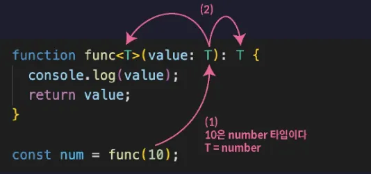

# 0. 제네릭 소개

## 제네릭이란

> **함수나 인터페이스, 타입 별칭, 클래스 등을 다양한 타입과 함께 동작하도록 만들어주는 TS의 기능**
>

### 제네릭이 필요한 상황

다양한 타입의 매개변수를 받고 해당 매개변수를 그대로 반환하는 함수가 하나 필요하다고 가정

```tsx
function func(value: any) {
  return value;
}

let num = func(10);
// any 타입

let str = func("string");
// any 타입
```

→ 인수로 전달한 값을 그대로 반환하는 단순한 함수

→ 현재 num과 str의 타입은 any 타입이 됨. func 함수의 반환값 타입이 return 문을 기준으로 추론되었기 때문임

<br>

이렇게 함수 호출 결과를 저장하는 num, str 등의 변수가 any 타입으로 추론되면 다음과 같은 문제점이 발생함

```tsx
function func(value: any) {
  return value;
}

let num = func(10);
let str = func("string");

num.toUpperCase()
```

→ num에는 Number 타입의 값 10이 저장되어 있을 것이 분명

**→ but any 타입으로 추론되어 버렸기에 toUpperCase() 등의 String 타입의 메서드를 사용해도 TS가 오류를 감지하지 못함…**

<br>

그럼 매개변수의 타입을 any 말고 unknown 타입으로 정의

```tsx
function func(value: unknown) {
  return value;
}

let num = func(10);
// unknown 타입

let str = func("string");
// unknown 타입

num.toUpperCase(); // ❌
num.toFixed(); // ❌
```

→ 이렇게 되면 toUpperCase 같은 메서드 호출은 방지할 수 있음.

<br>

하지만 또다른 문제가 발생

- toFixed 같은 Number 타입의 메서드 호출도 함께 오류로 판단하게 됨…
- 따라서 num에 10이 저장될 것이 분명해도 이 값을 사용하면 비효율적으로 타입 좁히기를 이용해야 함

```tsx
function func(value: unknown) {
  return value;
}

let num = func(10);
// unknown 타입

let str = func("string");
// unknown 타입

if (typeof num === "number") {
  num.toFixed();
}
```

<br>

⭐ 문제해결

**→ 이럴 때 제네릭을 사용함**

<br>

### 제네릭 함수

제네릭이란 일반적인 또는 포괄적인이라는 뜻을 가지고 있음.

**따라서 제네릭 함수는 일반적인 함수 또는 포괄적인 함수 정도로 해석 할 수 있음**

<br>

다음과 같이 제네릭 함수를 선언할 수 있음

```tsx
function func<T>(value: T): T {
  return value;
}

let num = func(10);
// number 타입
```

→ 함수 이름 뒤에 꺽쇠를 열고 타입을 담는 변수인 타입 변수 T를 선언함. 그리고 매개변수와 반환값의 타입을 이 타입변수 `T`로 설절

<br>

T에 어떤 타입이 할당될지는 함수가 호출될 때 결정됨.


- func(10)처럼 Number 타입의 값을 인수로 전달하면 매개변수 value에 Number 타입의 값이 저장되면서 T가 Number 타입으로 추론됨.
- 이때 T가 Number 타입으로 추론됨. 그럼 이때의 func함수의 반환값 타입또한 Number 타입이 됨




제네릭 함수를 호출할 때 다음과 같이 타입 변수에 할당할 타입을 직접 명시하는 것도 가능함

```tsx
function func<T>(value: T): T {
  return value;
}

let arr = func<[number, number, number]>([1, 2, 3]);
```

<br>

위 코드의 흐름

1. T에 [Number, Number, Number] 튜플 타입이 할당됨
2. 매개변수 value와 반환값 타입이 모두 튜플 타입이 됨

<br>

위 코드에서 타입 변수에 할당할 타입을 튜플 타입으로 설정하지 않았다면 T가 number[] 타입으로 추론되었을 것. TS는 타입을 추론할 때 항상 일반적이고 좀 더 범용적인 타입으로 추론하기 때문.

**→ 할당하고 싶은 특정 타입이 존재하면 함수 호출과 함께 꺽쇠를 열고 직접 명시해주는게 좋음**
